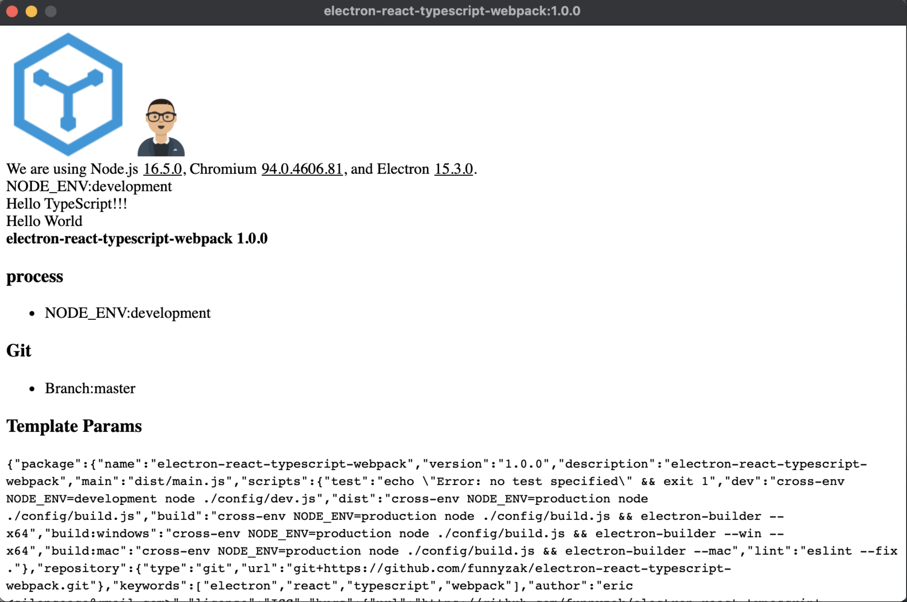

# Electron React Typescript Webpack

## 说明

基于React Typescript Webpack构建Electron应用脚手架。

- babel语法支持
- typescript支持
- react支持
- sass 支持
- less 支持
- hbs文件 模板支持
- png|svg|jpg|jpeg|gif 引入支持

### 运行

  
## 环境

使用的Node的构建版本为 **v14.17.0**，为避免冲突，建议使用此版本。可以使用 ***nvm*** 管理Node版本。

主要依赖库版本：

- electron: ^15.3.0
- electron-builder: ^22.13.15
- eslint: ^7.32.0
- babel: ^7.15.8
- css-loader: ^6.4.0
- less: ^4.1.2
- sass: ^6.0.1
- typescript: ^4.4.4
- webpack: ^5.59.1

## 目录

- `public`：静态资源文件夹
- `config`：webpack打包配置
- `config/index.js`: 常用配置, edit here
- `src/main`：electron main进程文件，code here
- `src/renderer`：renderer src, code here
  
## 使用

执行：`yarn install` or `npm install`，然后：

- 开发环境：`yarn dev`
- Lint格式化：`yarn lint`
- 源构建输出：`yarn dist`
- 根据当前系统构建：`yarn build`
- 基于dist输出，根据当前系统构建：`yarn build:now`
- 构建Windows二进制：`yarn build:windows`
- 构建Mac二进制：`yarn build:mac`
- 构建Linux二进制：`yarn build:mac`

## 打包

- 源构建输出：`./dist`
- 打包输出目录：`./build`

## 参考

- [Electron](https://electronjs.org/docs)
- [Babel Config](https://babel.docschina.org/docs/en/7.0.0/configuration/)
- [EsLint](https://eslint.org/docs/user-guide/configuring/)
- [eslintignore-file](https://eslint.org/docs/user-guide/configuring/ignoring-code#the-eslintignore-file)
- [TSconfig](https://www.typescriptlang.org/tsconfig/)
- [npmrc](https://docs.npmjs.com/cli/v7/configuring-npm/npmrc)
- [gitignore](https://git-scm.com/docs/gitignore)
- [webpack](https://webpack.docschina.org/guides/getting-started/)
- [prettier](https://prettier.io/docs/en/index.html)

## License

MIT License © 2021 [funnyzak](https://github.com/funnyzak)
